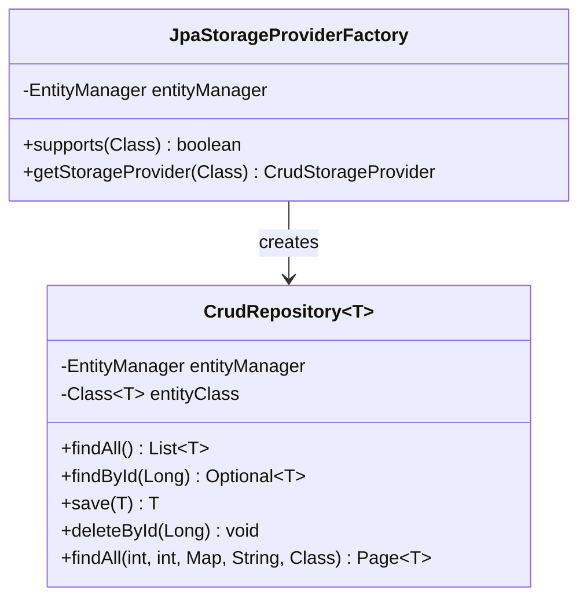
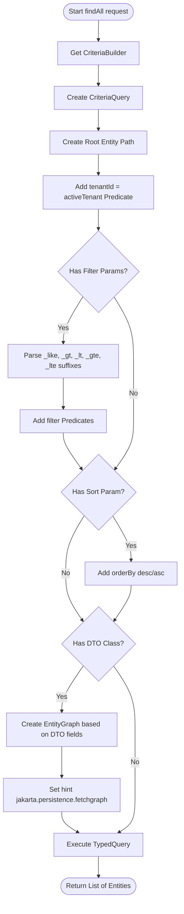

# JPA Storage Module Architecture (Mermaid)

This file contains Mermaid diagrams visualizing the structure and design of the JPA storage module (`crud-engine-jpa`).

## 1. Class Structure

## 2. Query Builder Execution Flow

